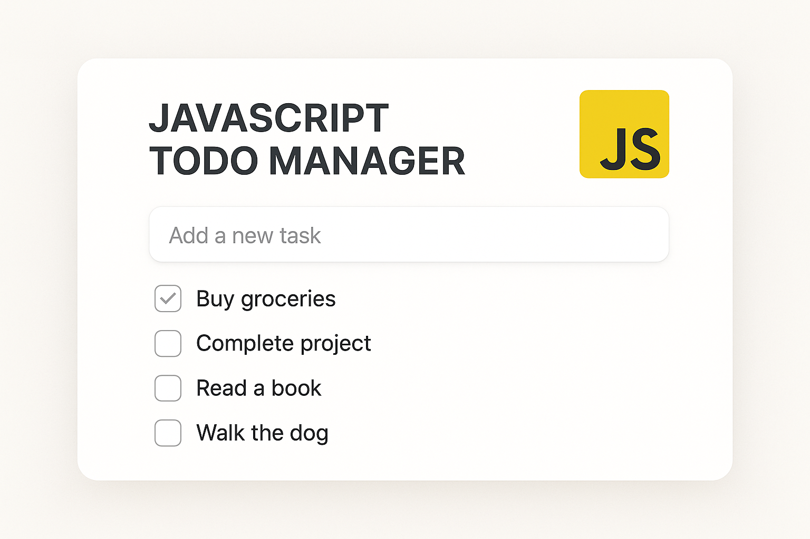

# JavaScript-Todo-Manager

**Sistema Avançado de Gerenciamento de Tarefas**

Um aplicativo de lista de tarefas construído com Node.js para ajudar você a organizar suas tarefas diárias de forma eficiente.

## 🖼️ Imagem Hero



## Início Rápido

Para começar com o projeto, siga os passos abaixo:

```bash
npm install
npm start
```

## Autor

Gabriel Demetrios Lafis

---

# JavaScript-Todo-Manager

**Advanced Todo Management System**

A todo list application built with Node.js to help you organize your daily tasks efficiently.

## 🖼️ Hero Image


## Quick Start

To get started with the project, follow the steps below:

```bash
npm install
npm start
```

## Author

Gabriel Demetrios Lafis

